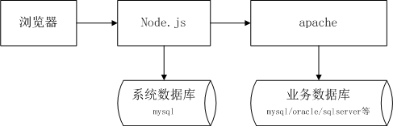

# 新架构设计构思

​	

## 现有架构说明

​		

在海纳MES项目中，我们采用的是最基础的单体架构模式，整个系统由一个apache服务承载运行。系统架构图如下：

​	

​		

实践发现，目前的架构方式存在一些缺陷，制约了项目开发的效率和质量。主要问题有：

​	

1：前后台开发的沟通成本仍然较大

前后台通过接口传输数据时，需要考虑很多问题，比如权限、身份认证、错误处理、日志记录、文件传输格式、图片传输方式、消息推送逻辑等。

理想情况下，我们希望后台采用面向服务的架构方式（SOA），后台仅提供单纯的业务数据，不要去考虑用户认证、日志处理等与业务无关的内容。这样的话，前后台之间耦合就会很低。

​	

2：通用模块抽取的成本很大

有一些通用的功能，比如菜单、权限、日志、消息推送等。这些逻辑在不同项目中，往往会主体上相似，却存在一些细节的不同。

理想状况下，我们希望把这些逻辑封装为模块，并提供一定的可配置性和可拓展性，使其适用于不同的项目中，降低重复开发造成的浪费。然而，这些功能大多需要前后台复杂的配合，必须在前台和后台充分沟通的前提下，分别封装为js模块和java模块，操作困难，可行性较差。

## 新的架构设计

新架构的示意图如下：

​	

​	

从图中可以看到，新的架构添加了一个nodejs服务，以及一个额外的mysql数据库。

nodejs承载web服务，我们在浏览器中输入url时，由nodejs返回html页面；通过浏览器发出的ajax请求，也由nodejs接收处理。

大部分与业务无关的通用功能，直接在nodejs层实现，包括菜单、权限、消息、日志等。当需要业务数据时，nodejs层向后台apache服务发起http请求，获取json数据。

后台apache服务提供restful api服务，提供单纯的业务数据。

考虑到nodejs对mysql数据库有良好的支持，我们需维护一个mysql数据库供nodejs使用，在其中维护用户、菜单、消息、日志等信息。如果后台使用的数据库也是mysql，则可以把两个数据库合并到一起。

​	

## 新旧架构的区别

​	

| 对比项目     | 旧架构                                                       | 新架构                                                       |
| ------------ | ------------------------------------------------------------ | ------------------------------------------------------------ |
| 结构         | 一个apache服务，一个数据库                                   | 一个node服务，一个apache服务，两个数据库                     |
| 功能实现方式 | 所有后台功能在java端实现                                     | 业务功能在java端实现，与业务无关的逻辑在nodejs实现           |
| 数据存储     | 所有数据在一个数据库中                                       | 业务数据和非业务数据分别在两个数据库维护                     |
| 权限认证方式 | 浏览器端和java端通过token进行身份认证                        | 浏览器端和nodejs端通过session认证；nodejs端和java端之间无需认证，将apache配置为仅允许本机访问即可 |
| 渲染方式     | 客户端渲染，用户访问页面时，先加载一个空白网页，之后通过js代码绘制出html元素 | 服务端渲染，在nodejs服务端把网页生成好，下载到浏览器中直接显示 |
| 数据交互方式 | 页面加载完成后，通过ajax从服务端获取业务数据，加载到页面中   | 页面的初始数据在服务端加载；后续用户操作时，通过ajax获取数据，加载到页面中 |
| 路由方式     | 采用SPA单页模式，整个系统只有一个大页面，通过浏览器url中的#部分实现hash路由 | 普通的多页模式，在服务端实现路由                             |
| 部署方式     | 将编译后的前台、后台代码组合在一起发布到apache               | 将编译后的前台代码发布到nginx，后台代码发布到apache，将nginx和apache部署在一台服务器上 |

​		

## 新架构的优缺点

​	

### 优势1：提高页面速度

新架构采用服务端渲染，浏览器加载已经绘制好的html，有效提高页面加载速度。

​		

### 优势2：便于封装通用模块

通用功能基本在nodejs层实现，与后台java完全无关，可以方便的将相关代码封装为javascript模块，提高代码复用性。

​	

### 优势3：java代码更简单

后台java代码编写更容易，开发成本降低。

​	

### ​优势4：路由方式更加灵活	

旧版架构采用hash路由，hash值无法用于页面内跳转，且查询字符串难以使用，诸多不便。新的路由方式更加简洁优雅。

### 优势5：后台单元测试更方便

旧版架构中，后台单元测试api时，必须先模拟一次登录请求，将获取到的token手动复制，粘贴到请求头部分，才能测试其它api。单元测试的操作很不友好。

新架构后台不再考虑权限问题，因此单元测试工作将更加简单优雅。

​	

### 缺点1：部署更加复杂	

新架构增加了一个nodejs服务以及一个数据库，部署将更加复杂。

​	

### 缺点2：前台学习成本增加

新架构中，前端用到的开发技术更多了，需要额外的学习成本。

## 研发成本评估

对于java端，只需要删除关于权限处理的代码，改动很小，可以忽略。

对于javascript端，新框架仍然使用react，只是由浏览器端渲染修改为nodejs渲染。现有的前台组件基本可以继续使用，改动较小。

新框架研发大概需要1.5个人月的工作量。

